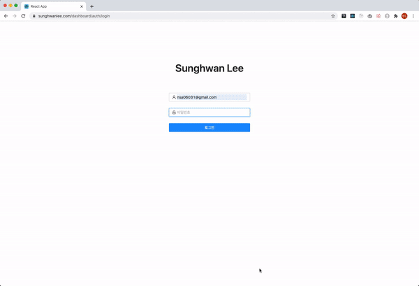

# Shlee Dashboard
모션 디자이너 Shlee의 [포트폴리오 사이트](https://sunghwanlee.com)의 대시보드 앱

## Features
* 🔑 인증: 로그인한 사용자만 대시보드를 이용할 수 있습니다.
* 📌 프로젝트 생성: 프로젝트 생성 기능을 제공합니다. 이미지를 업로드할 수 있습니다.
* ✍️ 프로젝트 수정: 생성한 프로젝트를 수정할 수 있습니다.
* 🎰 프로젝트 순서 변경: 드래그로 손쉽게 프로젝트의 순서를 변경할 수 있습니다.
* 🔥 프로젝트 삭제: 프로젝트를 삭제할 수 있습니다.
* 🍥 로딩 아이콘: API 응답이 지연될 경우 로딩 아이콘을 띄워 사용자 경험을 향상시킵니다.

### Upcoming Features(v0.2 예정)
* 방문자 통계
* Typescript 적용
* UI 컴포넌트 제작
* 다크 테마 지원
* 반응형 대응
